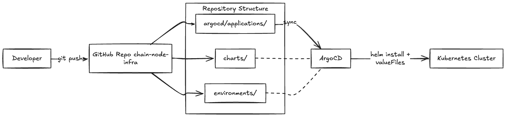
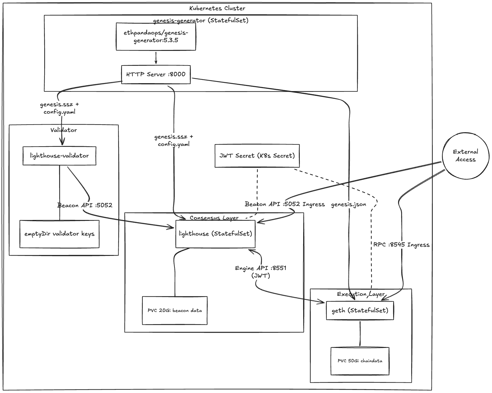
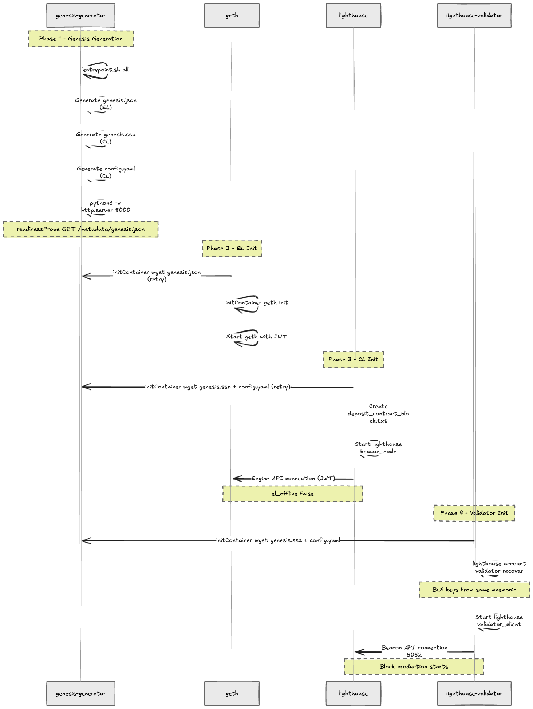

# Architecture

## Repository Structure

```
chain-node-infra/
├── charts/                  # Helm charts (the "what")
│   ├── common/              # Library chart: shared helpers
│   └── geth/                # Application chart: geth EL node
├── argocd/                  # ArgoCD config (the "orchestration")
│   └── applications/        # One Application manifest per deployment
├── scripts/                 # CI/CD helpers
├── docs/                    # Documentation
└── .github/workflows/       # GitHub Actions
```

## GitOps Flow



```
Developer          GitHub             ArgoCD              Kubernetes
   │                  │                  │                     │
   ├─ git push ──────>│                  │                     │
   │                  ├─ lint/test ──>   │                     │
   │                  ├─ merge ────>     │                     │
   │                  │                  ├─ detect change      │
   │                  │                  ├─ helm template      │
   │                  │                  ├─ sync ─────────────>│
   │                  │                  │                     ├─ apply
   │                  │                  │<── health check ────┤
   │                  │                  ├─ status: Synced     │
```

## Ethereum Private Network Architecture





## Chart Design Principles

### Client-Based Naming

Charts are named after the client binary, not the chain:

| Chart | Client | Chain | Role |
|-------|--------|-------|------|
| `geth` | go-ethereum | Ethereum | Execution Layer |
| `lighthouse` | Lighthouse | Ethereum | Consensus Layer |
| `bor` | Bor | Polygon | Execution Layer |
| `heimdall` | Heimdall | Polygon | Consensus Layer |

This allows deploying different clients for the same chain (e.g., switching from geth to nethermind).

### Common Library Chart

`charts/common/` is a Helm library chart (`type: library`) that provides shared template helpers:

- `common.names.name` - Chart name (truncated to 63 chars)
- `common.names.fullname` - Release-qualified name
- `common.labels.standard` - Standard Kubernetes labels
- `common.labels.matchLabels` - Selector labels

Application charts depend on it:

```yaml
# charts/geth/Chart.yaml
dependencies:
  - name: common
    version: 0.1.x
    repository: "file://../common"
```

And call its helpers:

```yaml
# charts/geth/templates/_helpers.tpl
{{- define "geth.labels" -}}
{{ include "common.labels.standard" . }}
{{- end }}
```

### StatefulSet Over Deployment

Blockchain nodes use StatefulSet because:

- **Stable storage**: Chain data must persist across pod restarts
- **Stable identity**: Consistent pod names for monitoring and debugging
- **Ordered operations**: Graceful shutdown is critical for data integrity

### ci/ Directory

The `ci/` directory inside each chart contains values files for [chart-testing](https://github.com/helm/chart-testing):

```
charts/geth/ci/
└── default-values.yaml    # Tested by `ct lint` and `ct install`
```

This is **NOT** for environment separation (dev/prod). Environment-specific values belong in `argocd/applications/`.

## ArgoCD Integration

Each deployment has an Application manifest in `argocd/applications/`:

```yaml
spec:
  source:
    path: charts/geth          # Points to chart in this repo
    helm:
      values: |                # Inline value overrides
        config:
          network: mainnet
  destination:
    namespace: ethereum         # Target namespace
  syncPolicy:
    automated:                  # Auto-sync on git push
      prune: true
      selfHeal: true
```

## Future Expansion

| Feature | Approach |
|---------|----------|
| New clients | Add `charts/<client>/` directory |
| Multi-chain | Add more ArgoCD Application manifests |
| Auto-discovery | Migrate to ArgoCD ApplicationSet |
| Environment split | Add `deployments/<chain>/<env>/` with values overlays |
| Secret management | External Secrets Operator via ArgoCD bootstrap |
| Monitoring | Prometheus ServiceMonitor in chart templates |
